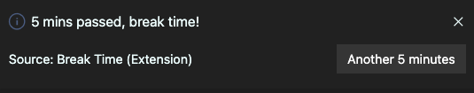

# Break Time README

This extension will remind to take a break during your coding sessions.

## Features

### **_Starting_**

-Just click the **next break button** in the status bar.

-A **quick pick** will show up, pick the time and a timer will be set.

-In the status bar the extension will tell you the **time left** for break time.

-When is **break time** an information **message** will pop up.

-If you press **another 5 minutes** a new timer will be set to 5 mins.

### **_Stop the timer_**

-To **stop** the timer, press the button and click STOP at the top of the quick pick.

## Extension Settings

This extension contributes the following settings:

-   `BreakTime.enable`: enable/disable this extension.
-   `BreakTime.redText`: Set when the time will be displayed in red.
    
-   `BreakTime.showLastMinute`: Enable to see seconds last minute. Default will display <1 min.
-   `BreakTime.endMessages`: custom your own messages to display when break time.

          Example:

          "BreakTime.endMessages": ["go take a walk!", "call the boss!", "stretch the leg!"]

## **Enjoy!**
